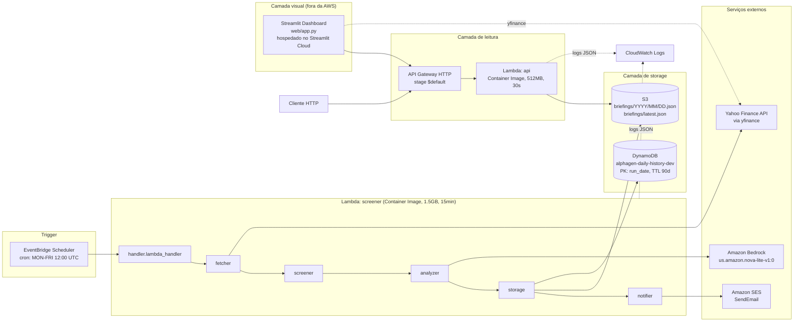

# AlphaGen Daily — Arquitetura Técnica

Documento de referência técnica profunda. Complementa o [`CONTEXT.md`](./CONTEXT.md), que cobre o "o quê" e o "por quê" do projeto em nível de produto. Este arquivo cobre o "como" em nível de engenharia: contratos de módulo, esquema de storage, permissões, configuração, observabilidade, custo e limitações conhecidas.

## Índice

1. [Visão geral e princípios](#1-visão-geral-e-princípios)
2. [Diagrama de alto nível](#2-diagrama-de-alto-nível)
3. [Pipeline de screening (Lambda screener)](#3-pipeline-de-screening-lambda-screener)
4. [API HTTP (Lambda api)](#4-api-http-lambda-api)
5. [Módulos e responsabilidades](#5-módulos-e-responsabilidades)
6. [Modelo de dados](#6-modelo-de-dados)
7. [Layout de storage](#7-layout-de-storage)
8. [Superfície de configuração](#8-superfície-de-configuração)
9. [Mapa de recursos AWS e permissões](#9-mapa-de-recursos-aws-e-permissões)
10. [Infraestrutura como código e deploy](#10-infraestrutura-como-código-e-deploy)
11. [Observabilidade](#11-observabilidade)
12. [Segurança](#12-segurança)
13. [Modelo de custo](#13-modelo-de-custo)
14. [Limitações conhecidas e trade-offs](#14-limitações-conhecidas-e-trade-offs)

---

## 1. Visão geral e princípios

O AlphaGen Daily é composto por dois serviços independentes que compartilham o mesmo repositório de código e a mesma imagem Docker, mas rodam em Lambdas separadas:

- **Screener**: pipeline batch de execução diária. Baixa dados, filtra, analisa via LLM e persiste.
- **API**: leitor sob demanda dos briefings persistidos.

Três princípios guiam as escolhas técnicas:

**Serverless first.** Nenhum componente longa-duração. Custo em modo idle deve ser exatamente zero. Isso descarta EC2, RDS, containers de serviço contínuo. Todo estado vive em S3 e DynamoDB.

**Falha degradada, nunca cascata.** Uma requisição a Yahoo Finance falhar não pode derrubar o run inteiro. Uma resposta malformada do Bedrock não pode derrubar o batch. O sistema prefere um briefing com menos tickers a nenhum briefing.

**Configuração via env, código imutável.** Thresholds do screener, model ID do Bedrock, delays de rate-limit, tudo configurável em runtime via variáveis de ambiente definidas no `template.yaml`. Nenhum "magic number" no código Python.

---

## 2. Diagrama de alto nível



---

## 3. Pipeline de screening (Lambda screener)

O `handler.lambda_handler` orquestra cinco estágios sequenciais. Se qualquer estágio lança exceção não tratada, o Lambda registra o erro estruturado em CloudWatch e falha o run (EventBridge tentará novamente na próxima execução agendada, o Lambda não faz retry interno).

### 3.1 Fetch (`src/fetcher.py`)

Entrada: lista de símbolos (a constante `AI_UNIVERSE`).
Saída: `list[Ticker]` (dataclasses imutáveis com snapshot de preço + fundamentais).

Duas fases dentro do estágio:

**Batch de histórico de preços.** Um único `yf.download()` puxa ~300 dias de OHLC para todos os tickers de uma vez (single HTTP call agrupado). Retorna DataFrame multi-índice.

**Fetch serial de fundamentais.** Loop por símbolo chamando `yf.Ticker(symbol).info` com `time.sleep(0.35)` entre chamadas. Cada resposta vira um `Ticker` calculando SMA20/50/200 do close e extraindo market cap, EPS growth Q/Q, Y/Y, forward e P/E do dict `info`.

O parâmetro `max_workers` na assinatura é mantido para compatibilidade da API mas ignorado. Threading paralelo foi tentado e descartado por rate-limit do Yahoo em IPs de datacenter (ver seção 14).

Falha por ticker: `logger.warning` estruturado com símbolo e erro, ticker é pulado. Falha global (Yahoo indisponível, DataFrame vazio): retorna lista vazia, screener recebe zero itens, pipeline continua sem quebrar.

### 3.2 Screening (`src/screener.py`)

Entrada: `list[Ticker]` + `Config`.
Saída: `list[Ticker]` (subset aprovado).

Aplica quatro filtros em ordem, com short-circuit:

1. `eps_growth_qoq >= MIN_EPS_GROWTH_QOQ` (default deployado: 10%)
2. `eps_growth_yoy >= MIN_EPS_GROWTH_YOY` (default deployado: 15%)
3. `current_price <= MAX_PRICE` (default deployado: 500)
4. `SMA20 > SMA50 > SMA200` (só se `REQUIRE_SMA_UPTREND=true`)

Missing data em qualquer filtro obrigatório = rejeitado. Postura conservadora: prefere excluir um ticker duvidoso a incluir com base incompleta.

Emite log estruturado agregando contadores por motivo de rejeição, útil para tunar thresholds via CloudWatch Logs Insights.

### 3.3 Análise LLM (`src/analyzer.py`)

Entrada: `list[Ticker]` aprovados + `Config`.
Saída: `list[ScreeningResult]` (ticker + thesis + key_risk + model_id).

Para cada ticker chama `bedrock-runtime.converse()` com:

- **System prompt fixo** enquadrando o modelo como "disciplined equity research assistant", proibindo inventar números e proibindo dar recomendação de compra/venda.
- **User prompt formatado** com os metadados do ticker e template pedindo JSON `{thesis, key_risk}` com limite de 300 caracteres total.
- **Inference config**: `maxTokens=400`, `temperature=0.4`.

Parsing defensivo em `_parse_llm_response`: aceita markdown fences (`` ```json ``), verifica campos vazios, cai em fallback string se JSON parse falhar. O ticker nunca é descartado por falha de LLM, entra no briefing com tese e risco de fallback.

Chamadas serializadas com `time.sleep(0.5)` entre requests para respeitar TPS quota do Nova Lite.

### 3.4 Assembly (`DailyBriefing.create`)

Cria dataclass `DailyBriefing` com `run_date` (UTC ISO date), `generated_at` (UTC ISO timestamp), contadores e a lista de `ScreeningResult`.

### 3.5 Persistência (`src/storage.py`)

Duas escritas em ordem: S3 primeiro (source of truth), DynamoDB segundo (índice).

**S3.** `persist_to_s3` grava dois objetos idênticos:
- `briefings/YYYY/MM/DD.json` (versionado por data)
- `briefings/latest.json` (sempre a mais recente, sobrescrita)

Content-Type `application/json`, encoding UTF-8, indent 2 para leitura humana.

**DynamoDB.** `persist_to_dynamodb` grava um item com metadados apenas (não o payload completo):
- `run_date` (PK, string YYYY-MM-DD)
- `generated_at`, `universe_size`, `approved_count`
- `approved_symbols` (lista de strings)
- `s3_key` (pointer para o JSON completo em S3)
- `ttl` (Unix epoch + 90 dias)

Conversão `float → Decimal` recursiva em `_to_dynamodb_safe` para compatibilidade com o tipo Number do DynamoDB.

### 3.6 Notificação (`src/notifier.py`)

Estágio final opcional, envolvido em try/except próprio no `handler.py` para que falha de email nunca falhe o run (o briefing já está persistido).

Entrada: `DailyBriefing` + `Config`.
Saída: nenhuma (efeito colateral: email enviado, ou log de falha).

Gate por `config.notify_enabled`: se falso, sai imediatamente com log INFO. Se sender ou recipients vazios (mesmo com notify enabled), log WARNING e sai — falha ruidosa em vez de silenciosa.

Renderiza duas versões da mesma mensagem:
- **HTML rich** com inline styles (obrigatório em email: `<style>` tag é removida por Gmail/Yahoo)
- **Plain text** de fallback

Ambas enviadas juntas em `Message.Body.Html` + `Message.Body.Text` — o padrão `multipart/alternative` do SMTP. Cliente de email escolhe qual renderizar.

Layout HTML: container 600px (padrão de facto pra mobile+desktop), header escuro com data + contadores, uma seção por ticker aprovado com preço/EPS/setor/tese/risco, footer com disclaimer legal e model_id do Bedrock. Tabelas aninhadas em vez de flexbox porque Outlook desktop usa engine do Word que não faz flexbox.

Assunto do email: `AlphaGen Daily — {run_date}: {approved_count} aprovados`, com contadores no próprio subject line para leitura rápida no preview do inbox.

Chamada SES via `bedrock-runtime` boto3 client (`ses.send_email`), region da config. Falha (`ClientError`) é logada como ERROR e engolida — retorna sem propagar.

---

## 4. API HTTP (Lambda api)

Handler `src/api_handler.py`, Lambda separada montada na mesma imagem Docker mas com CMD diferente. Roteamento manual (não usa framework) baseado em `event['rawPath']`.

### Rotas

| Método | Path | Comportamento |
|---|---|---|
| GET | `/today` | Lê `s3://{bucket}/briefings/latest.json` e retorna body |
| GET | `/history/{YYYY-MM-DD}` | Valida formato de data, monta S3 key `briefings/YYYY/MM/DD.json`, lê e retorna |
| qualquer outra | qualquer | 404 JSON |

### Contrato de resposta

Sempre JSON, sempre com header `Access-Control-Allow-Origin: *` (API pública por design). Códigos usados:

- `200` sucesso
- `400` formato de data inválido em `/history/{date}`
- `404` briefing não encontrado (ainda não rodou, ou data sem dados)

Corpos de erro são objetos `{"error": "..."}` compactos.

### Comportamento em erro

`ClientError` do boto3 é logado estruturado. `NoSuchKey` do S3 vira 404 explícito com mensagem amigável. Outros erros de S3 caem em 404 genérico com log de warning (a API prefere devolver "não encontrei" a expor detalhe interno).

---

## 4.5 Streamlit dashboard (consumer)

Aplicação frontend desacoplada do backend, single-file (`web/app.py`), hospedada no Streamlit Community Cloud em `https://alphagen-daily.streamlit.app`. Consome apenas a API pública (`/today` e `/history/{date}`) — não fala com S3, DynamoDB, Lambda ou qualquer serviço AWS diretamente. Isso torna o app portátil: qualquer pessoa pode fazer fork e apontar pra outra API sem tocar em código AWS.

### Componentes da UI

- Header + subtítulo com data do briefing
- Row de KPIs (universo, aprovados, data)
- Painel de parâmetros CANSLIM expansível com os thresholds em produção
- Sidebar com filtros: data (padrão hoje, com `date_input` para histórico), multiselect de setores, ordenação
- Grid de cards por ticker aprovado (métricas + tese + risco chave)
- Por card: expander "Ver preço e médias móveis" que renderiza chart Plotly de OHLC + SMA20/50/200 dos últimos ~180 dias

### Fluxo de dados

- Ao abrir, chama `GET /today` (cache TTL 5min)
- Ao trocar data no sidebar, chama `GET /history/{YYYY-MM-DD}` (mesma cache function chaveada por argumento)
- Ao expandir chart de um ticker, chama `yfinance.download(symbol)` (cache TTL 1h) e calcula SMAs no pandas
- Filtros e ordenação são client-side sobre o JSON já recebido

### Caching

`@st.cache_data` decora as duas funções de fetch. Streamlit chaveia por argumentos, então `fetch_briefing()` e `fetch_briefing("2026-08-30")` são entries separadas. TTL diferenciado: briefing 5min (muda 1x/dia mas UX espera atualização se você fica com a aba aberta), price history 1h (dado varia pouco na escala de 180 dias).

### Deploy

Streamlit Cloud lê o repo GitHub. Configuração: `Repository=Ant4rez/Alphagen-Daily`, `Branch=main`, `Main file path=web/app.py`. `web/requirements.txt` isolado (não usa o `requirements.txt` do backend). Cada push na `main` que toque em `web/` dispara redeploy automático em ~2min.

Limitações do Cloud gratuito: 1GB RAM (mais que suficiente), app entra em sleep após ~10min sem tráfego (primeira request depois demora ~30s pra acordar).

### Trade-offs

- **Constante `DEPLOYED_THRESHOLDS`** no topo de `app.py` duplica os valores do `template.yaml`. Fonte única exigiria endpoint `/config`. Aceitável hoje, TODO explícito.
- **Chart via yfinance client-side** adiciona latência (~2-3s por ticker expandido), mas evita mudança de contrato na API. Alternativa futura: `GET /history/{symbol}` na API expondo OHLC.
- **Deploy fora da AWS** significa nada de VPC, nada de IAM. Streamlit Cloud é internet aberto, mas como só lê endpoint público sem segredos, é seguro.

---

## 5. Módulos e responsabilidades

Cada módulo tem uma única responsabilidade e um contrato claro de entrada/saída.

| Módulo | Responsabilidade única | Depende de |
|---|---|---|
| `handler.py` | Orquestrar os 6 estágios do pipeline batch | fetcher, screener, analyzer, storage, notifier, config, universe |
| `api_handler.py` | Servir os JSONs persistidos via HTTP | boto3 (S3), config |
| `fetcher.py` | Baixar preços e fundamentais, montar `Ticker` | yfinance, pandas, models |
| `screener.py` | Aplicar filtros CANSLIM sobre lista de `Ticker` | models, config |
| `analyzer.py` | Chamar Bedrock, parsear JSON, montar `ScreeningResult` | boto3 (bedrock-runtime), models, config |
| `storage.py` | Escrever S3 e DynamoDB | boto3 (s3, dynamodb), models, config |
| `notifier.py` | Renderizar HTML+text e enviar email via SES | boto3 (ses), models, config |
| `models/ticker.py` | Snapshot imutável de um ativo | (só stdlib) |
| `models/screening_result.py` | Resultado enriquecido + agregação em `DailyBriefing` | ticker |
| `universe/ai_tickers.py` | Universo curado por vertical + função de filtro | (só stdlib) |
| `utils/config.py` | Carregar env vars em `Config` imutável | (só stdlib) |
| `utils/logger.py` | Logger JSON estruturado | (só stdlib) |
| `web/app.py` | Dashboard Streamlit consumindo a API pública | streamlit, requests, pandas, plotly, yfinance |

Regra arquitetural: nenhum módulo lê `os.environ` diretamente, apenas via `utils.config.load_config()`. Nenhum módulo instancia `logging.getLogger(...)` diretamente, apenas via `utils.logger.get_logger(__name__)`.

---

## 6. Modelo de dados

Três dataclasses, todas serializáveis para JSON via `to_dict()`.

### `Ticker`

Frozen dataclass. Snapshot de um ativo no momento do screening. Campos:

```
symbol, company_name, sector, industry
current_price, sma_20, sma_50, sma_200
market_cap, eps_growth_qoq, eps_growth_yoy, eps_growth_yoy_next, pe_ratio
```

Property `has_sma_uptrend` retorna `True` se SMA20 > SMA50 > SMA200 (todas presentes).

Campos numéricos aceitam `None` para dados ausentes. O screener trata `None` como reprovação em filtros obrigatórios.

### `ScreeningResult`

Ticker aprovado enriquecido com análise LLM.

```
ticker: Ticker
thesis: str        # 2-3 frases
key_risk: str      # 1 frase
llm_model: str     # ID do modelo Bedrock usado
```

### `DailyBriefing`

Payload completo de um run.

```
run_date: str                # YYYY-MM-DD (UTC)
generated_at: str            # ISO 8601 UTC
universe_size: int           # quantos tickers foram analisados
approved_count: int          # quantos passaram
results: list[ScreeningResult]
metadata: dict[str, Any]     # espaço para extensões futuras
```

Factory `DailyBriefing.create(universe_size, results)` timestampa automaticamente com `datetime.now(timezone.utc)`.

---

## 7. Layout de storage

### S3

Bucket: `alphagen-daily-briefings-${AWS::AccountId}-{Environment}`, criptografia SSE-S3 (AES256), versioning habilitado, block public access total.

Chaves:

```
briefings/
├── YYYY/
│   └── MM/
│       └── DD.json          # briefing do dia (imutável após escrita)
└── latest.json              # sempre a mais recente, sobrescrita todo run
```

Formato do objeto: JSON UTF-8, indent 2, corresponde ao `DailyBriefing.to_dict()`.

Retention: hoje sem lifecycle policy (guarda para sempre). Se crescer, um dia adicionar transição para Glacier após 6 meses.

### DynamoDB

Tabela: `alphagen-daily-history-{Environment}`, billing PAY_PER_REQUEST, TTL habilitado no atributo `ttl`.

Schema:

| Atributo | Tipo | Papel |
|---|---|---|
| `run_date` | String (S) | Partition Key, formato YYYY-MM-DD |
| `generated_at` | String (S) | ISO 8601 UTC |
| `universe_size` | Number (N) | quantos tickers foram analisados |
| `approved_count` | Number (N) | quantos passaram |
| `approved_symbols` | List of String (SS/L) | lista de símbolos aprovados |
| `s3_key` | String (S) | pointer para o JSON completo |
| `ttl` | Number (N) | Unix epoch em que o item expira (90 dias) |

Sem GSI por enquanto. Se um dia precisar "todos os dias em que NVDA foi aprovada", adicionar GSI por símbolo (mas isso muda o modelo, ver roadmap nível 4).

Escolha de arquitetura: DDB guarda **metadata apenas**, S3 é source of truth do conteúdo. Dois motivos: (1) item DDB não deve ultrapassar 400KB, um briefing com muitos tickers cabe mas fica no limite; (2) DDB read cost é maior que S3 GET para payloads grandes.

---

## 8. Superfície de configuração

Toda configuração é lida em `src/utils/config.py:load_config()` a partir de variáveis de ambiente. Nenhum default é hard-coded no código de negócio.

### Variáveis de ambiente

| Env var | Default no código | Deployado (template.yaml) | Descrição |
|---|---|---|---|
| `AWS_REGION` | `us-east-1` | (herdado do Lambda) | Região dos serviços AWS |
| `S3_BUCKET` | `alphagen-daily-briefings` | `!Ref BriefingsBucket` | Nome do bucket S3 |
| `DYNAMODB_TABLE` | `alphagen-daily-history` | `!Ref HistoryTable` | Nome da tabela |
| `BEDROCK_MODEL_ID` | `amazon.nova-lite-v1:0` | `us.amazon.nova-lite-v1:0` | ID do modelo Bedrock (prefixo `us.` obrigatório) |
| `BEDROCK_MAX_TOKENS` | `400` | (usa default) | Limite de tokens da resposta |
| `BEDROCK_TEMPERATURE` | `0.4` | (usa default) | Temperatura de sampling |
| `MIN_EPS_GROWTH_QOQ` | `15.0` | `10` | Threshold EPS Q/Q em % |
| `MIN_EPS_GROWTH_YOY` | `25.0` | `15` | Threshold EPS Y/Y em % |
| `MAX_PRICE` | `50.0` | `500` | Preço máximo em USD |
| `REQUIRE_SMA_UPTREND` | `true` | (usa default) | Aplicar filtro de SMA uptrend |
| `NOTIFY_ENABLED` | `false` | `true` | Kill switch mestre pra envio de email |
| `SES_SENDER` | `""` | (passado via `--parameter-overrides`) | Email remetente verificado no SES |
| `SES_RECIPIENTS` | `""` | (passado via `--parameter-overrides`) | Destinatários separados por vírgula |
| `MAX_WORKERS` | `5` | `5` | Ignorado no fetcher (mantido para API) |
| `LOG_LEVEL` | `INFO` | `INFO` | Log level do logger |

**Nota importante:** os defaults no código são estritos (thresholds altos, model ID sem prefixo). Os overrides no `template.yaml` refletem o que efetivamente roda em produção após tuning. Não confie nos defaults do `config.py` para entender o comportamento do sistema; consulte o `template.yaml`.

---

## 9. Mapa de recursos AWS e permissões

### Recursos criados pelo `template.yaml`

| Tipo | Nome CFN | Nome deployado | Config chave |
|---|---|---|---|
| `AWS::S3::Bucket` | `BriefingsBucket` | `alphagen-daily-briefings-${AWS::AccountId}-{Environment}` | SSE-S3, versioning on, PublicAccessBlock total |
| `AWS::DynamoDB::Table` | `HistoryTable` | `alphagen-daily-history-{Environment}` | PAY_PER_REQUEST, PK run_date, TTL ativo |
| `AWS::Serverless::Function` | `ScreenerFunction` | `alphagen-daily-screener-{Environment}` | Image, 1536MB, 900s, cron trigger |
| `AWS::Serverless::Function` | `ApiFunction` | `alphagen-daily-api-{Environment}` | Image, 512MB, 30s, HttpApi trigger |
| `AWS::Serverless::HttpApi` | `HttpApi` | (gerado pela AWS) | CORS wide open, stage `$default` |

### Políticas IAM

**ScreenerFunction** recebe:
- `S3CrudPolicy` sobre `BriefingsBucket` (put/get/delete/list)
- `DynamoDBCrudPolicy` sobre `HistoryTable` (put/get/query/scan/update/delete)
- Statement custom: `bedrock:InvokeModel` e `bedrock:Converse` em `Resource: "*"` (Bedrock não aceita ARN específico para foundation models)
- Statement custom: `ses:SendEmail` e `ses:SendRawEmail` em `Resource: "*"` (poderia restringir ao ARN da identidade verificada, mas o sender vem de Parameter — trade-off pra não precisar sincronizar policy com config em cada mudança)
- AWSLambdaBasicExecutionRole (implícito, para CloudWatch Logs)

**ApiFunction** recebe (read-only por design):
- `S3ReadPolicy` sobre `BriefingsBucket`
- `DynamoDBReadPolicy` sobre `HistoryTable`
- AWSLambdaBasicExecutionRole

Princípio: cada Lambda recebe apenas o que precisa. A API nunca escreve; se um bug tentar, IAM bloqueia.

---

## 10. Infraestrutura como código e deploy

### Arquivos

```
infrastructure/
├── template.yaml          # SAM template principal
├── samconfig.toml         # config do SAM CLI (stack name, region, deploy prefs)
└── parameters/
    └── dev.json           # parâmetros do env dev (Environment=dev, etc)
```

### Build

Container Image build a partir do `Dockerfile` na raiz. Ambos os Lambdas usam a mesma imagem, o `ImageConfig.Command` no `template.yaml` diferencia:

- Screener: `["src.handler.lambda_handler"]`
- API: `["src.api_handler.lambda_handler"]`

Base image `public.ecr.aws/lambda/python:3.11`. Camadas: (1) `requirements.txt`, (2) `src/`. Isso maximiza cache: mudança só em `src/` não invalida a camada de dependências.

### Deploy

```bash
cd infrastructure/
sam build --use-container    # build via Docker, ~5-10min primeira vez
sam deploy                    # push para ECR + CloudFormation update
```

Se apenas variáveis de ambiente mudaram no `template.yaml`, pode pular o `sam build`. Apenas `sam deploy` atualiza as env vars sem rebuild da imagem.

Deploy inicial pergunta parâmetros (Environment, BedrockModelId, ScheduleExpression). Depois grava em `samconfig.toml` e usa nos deploys subsequentes.

---

## 11. Observabilidade

### Logs estruturados

Toda emissão passa por `utils.logger.get_logger(__name__)`. O logger formata cada record como JSON compact com campos:

```json
{
  "timestamp": "...",
  "level": "INFO",
  "logger": "src.screener",
  "message": "screening complete",
  "input_count": 63,
  "approved_count": 12,
  "rejection_reasons": {"eps_qoq": 24, "eps_yoy": 15, "price": 8, "sma_uptrend": 4},
  "approved_symbols": ["NVDA", "AMD", ...]
}
```

### CloudWatch Logs Insights

Queries úteis (rodar no console AWS, log group `/aws/lambda/alphagen-daily-screener-dev`):

Contagem de aprovados por dia:
```
fields @timestamp, approved_count
| filter message = "AlphaGen Daily run complete"
| sort @timestamp desc
```

Motivos de rejeição agregados:
```
fields rejection_reasons.eps_qoq, rejection_reasons.eps_yoy, rejection_reasons.price, rejection_reasons.sma_uptrend
| filter message = "screening complete"
| stats sum(rejection_reasons.eps_qoq) as total_eps_qoq, sum(rejection_reasons.eps_yoy) as total_eps_yoy
```

Erros de Bedrock por símbolo:
```
fields symbol, error
| filter message = "Bedrock invocation failed"
| stats count() by symbol
```

### Métricas nativas Lambda

Duration, Errors, Throttles, ConcurrentExecutions estão disponíveis em CloudWatch Metrics sem configuração adicional. Alarmes CloudWatch podem ser adicionados no `template.yaml` (não estão hoje, ficam para o P4).

---

## 12. Segurança

### Postura geral

- **Zero secrets no código.** Nada de API key hardcoded. Bedrock usa IAM role da Lambda, S3 e DDB idem.
- **Zero access público ao bucket.** PublicAccessBlock total ligado. A API Lambda tem role IAM read-only ao bucket, mas o bucket em si nunca é público.
- **CORS aberto na API por design.** É um endpoint público read-only de dados públicos (briefings de screening, não dados pessoais). CORS `*` facilita uso em Streamlit/dashboards.
- **Sem PII, sem dados sensíveis.** O conteúdo dos briefings é análise sobre tickers públicos. Nada que precise LGPD.

### Superfície de ataque

- **API Gateway público sem autenticação.** Alguém pode fazer muitas requisições e teoricamente incorrer em custo de Lambda + S3 GET. Mitigação futura (P4): usage plans + rate limiting.
- **Endpoint `/history/{date}` é enumerável.** Trivial listar todos os dias. Isso é intencional (histórico é público).
- **Bedrock quota compartilhada.** Se alguém invocar o Lambda screener manualmente muitas vezes (via `aws lambda invoke`), pode esgotar TPS do Bedrock. Mitigação: só o dono da conta pode invocar; EventBridge só invoca 1x/dia.

---

## 13. Modelo de custo

Estimativa de ordem de grandeza para o volume atual (~70 tickers, 1 run/dia útil, ~20 aprovados médios).

| Serviço | Uso mensal estimado | Custo estimado |
|---|---|---|
| Lambda (screener) | ~22 runs × ~60s × 1.5GB | $0.10-0.30 |
| Lambda (api) | trafego baixo, sub-segundo | ~$0 |
| Bedrock (Nova Lite) | ~22 × 20 chamadas × ~400 tokens | $0.05-0.15 |
| S3 storage | <1MB total | ~$0 |
| S3 requests | ~50 PUT/mês, GETs baixos | ~$0 |
| DynamoDB | ~22 PUT/mês, on-demand | ~$0 |
| API Gateway HTTP | tráfego baixo | ~$0 |
| SES | ~22 emails/mês (sandbox ilimitado até 200/dia) | ~$0 |
| CloudWatch Logs | ~200MB/mês | ~$0.10 |
| ECR | 2 imagens ~500MB cada | $0.10 |
| Streamlit Cloud | 1GB RAM, sleep após inatividade | ~$0 (gratuito) |
| **Total** | | **~$0.50-1.00/mês** |

Em free tier ou com créditos, o custo real hoje é praticamente zero. Os maiores drivers de aumento futuro serão: (1) aumentar frequência de execução, (2) crescer o universo, (3) aumentar `bedrock_max_tokens`, (4) tráfego da API se virar produto público.

---

## 14. Limitações conhecidas e trade-offs

**Fetch serial é o gargalo.** Cada run gasta ~40s no fetcher (70 tickers × 350ms + overhead). Threading foi tentado, mas Yahoo rate-limita datacenter IPs. Alternativas futuras: cache Redis/ElastiCache, migrar para fonte paga (Polygon, Alpha Vantage), ou fetch em batch menor com jitter maior.

**Sem retry no Bedrock.** Se `bedrock:Converse` falhar por throttling, a chamada não é retentada. O ticker recebe fallback thesis e entra no briefing mesmo assim. Pior caso: uma tempestade transitória no Bedrock deixa todo briefing com fallbacks. Mitigação futura: retry exponencial em ClientError com backoff.

**Sem cache de universo.** A cada run refaz todo o download, mesmo que o universo não mude por semanas. Não é problema hoje (custo é dominado pelo Bedrock), mas seria natural cachear em S3 as informações de sector/industry que só mudam quando a empresa faz reestruturação.

**Um único ambiente deployado.** Só `dev` existe. `prod` está previsto no template como `AllowedValue` mas nunca foi deployado. Quando fizer sentido separar, criar bucket, tabela e stack `-prod` correspondentes.

**Testes vazios.** Os arquivos `tests/test_screener.py` e `tests/test_analyzer.py` são esqueletos. `make test` roda mas não valida nada de fato. Prioridade: subir cobertura mínima em `screener.py` (lógica pura, fácil de testar) e em `_parse_llm_response` (função defensiva, precisa ser confiável).

**Universo estático.** Adição de ticker novo requer edição manual do `src/universe/ai_tickers.py` seguida de rebuild da imagem e redeploy. Não há mecanismo dinâmico (Parameter Store, tabela DDB de universo, etc). Aceitável enquanto o universo cabe na cabeça; se um dia crescer para centenas, considerar externalizar.

**Bedrock model hard-coded como US-only.** O prefixo `us.` no model ID assume região us-east-1 ou us-west-2. Se um dia migrar para região não-US, precisa mudar o prefixo para o cross-region inference profile correspondente (`eu.` para Europa, etc).

---

## Referências

- [`CONTEXT.md`](./CONTEXT.md) — briefing de projeto, decisões macro, roadmap
- [`alphagen_daily_roadmap.md`](./alphagen_daily_roadmap.md) — mapa completo de evolução (7 níveis)
- [`README.md`](./README.md) — quickstart e overview público
- [`infrastructure/template.yaml`](./infrastructure/template.yaml) — SAM template, source of truth da infra
