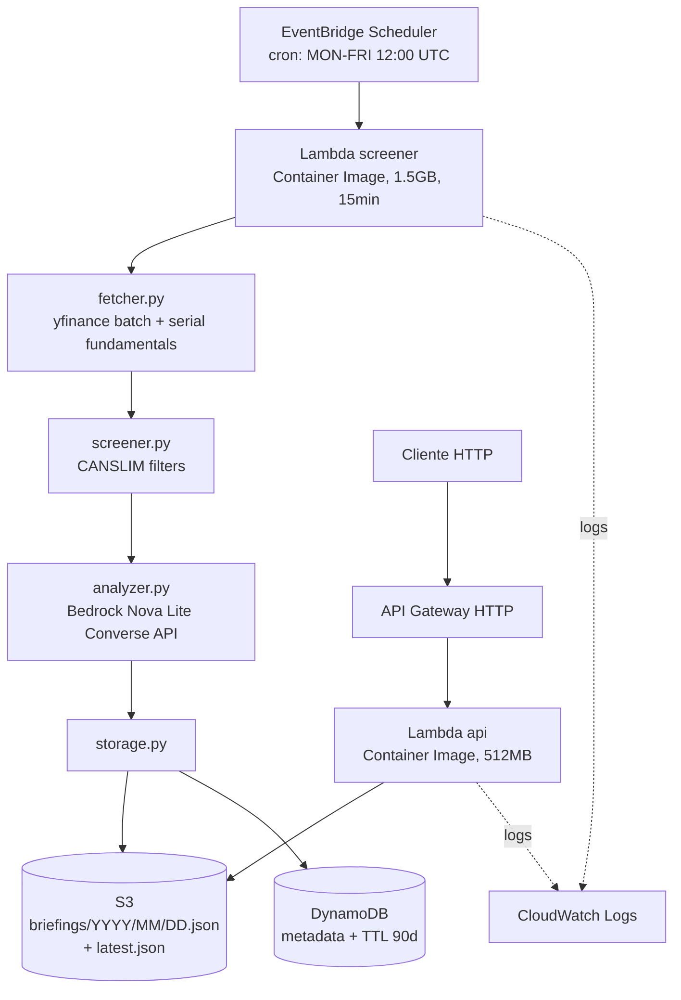

# AlphaGen Daily — Contexto do Projeto

## 1. O que é o projeto

**AlphaGen Daily** é um agente autônomo serverless na AWS que, todo dia útil antes da abertura do mercado americano, executa um pipeline completo de screening de ações relacionadas a Inteligência Artificial e gera análises automatizadas via LLM.

### Propósito

Existem cerca de 300 ações listadas nos EUA diretamente ligadas ao ecossistema de IA (chips, cloud, plataformas de dados, SaaS com IA embarcada, infraestrutura, quantum). Analisar essa base manualmente todos os dias é inviável. O AlphaGen Daily automatiza a triagem usando um método CANSLIM-inspirado (crescimento de EPS + momento técnico) e usa o Amazon Bedrock Nova Lite para gerar tese e risco chave para cada ação aprovada.

### Público-alvo (atual e futuro)

- **Hoje:** o próprio desenvolvedor (uso pessoal + portfólio + artigo AWS Builder Center)
- **Futuro possível:** investidores retail interessados em growth stocks tech, comunidade AWS, potencial produto SaaS

### Diferenciais técnicos

1. 100% serverless (custo em modo idle: zero)
2. Infraestrutura como código via AWS SAM (deploy reprodutível)
3. Observabilidade via CloudWatch Logs JSON estruturado
4. Container Image para contornar limite de ZIP do Lambda
5. Universo de tickers curado manualmente (não é sopa aleatória)

---

## 2. Estado atual — o que está em produção

### Deployment

O stack está deployado em ambiente `dev`, região `us-east-1`, criado via CloudFormation/SAM sob o nome de stack **alphagen-daily**.

### Recursos deployados

Todos criados via stack CloudFormation **alphagen-daily** (SAM):

| Recurso | Nome | Função |
|---|---|---|
| Lambda (Container Image) | `alphagen-daily-screener-dev` | Pipeline principal (fetch → screen → analyze → persist) |
| Lambda (Container Image) | `alphagen-daily-api-dev` | Endpoints HTTP `/today` e `/history/{date}` |
| S3 Bucket | `alphagen-daily-briefings-${AWS::AccountId}-dev` | Armazena JSON dos briefings (`briefings/YYYY/MM/DD.json` e `latest.json`) |
| DynamoDB Table | `alphagen-daily-history-dev` | Metadados de execução, TTL 90 dias |
| EventBridge Scheduler | `alphagen-daily-ScreenerFunctionDaily-*` | Cron `0 12 ? * MON-FRI *` (12:00 UTC dias úteis) |
| API Gateway HTTP | `HttpApi` | Endpoints públicos, stage `$default` |
| ECR Repositories | 2 (screener + api) | Imagens Docker do Lambda |

O nome do bucket resolve em deploy time via CloudFormation intrinsic `${AWS::AccountId}`, então cada conta AWS gera um nome único e o template funciona para qualquer conta sem edição.

### Endpoints públicos

- **Latest briefing:** `https://r0kn41v28a.execute-api.us-east-1.amazonaws.com/today`
- **Histórico por data:** `https://r0kn41v28a.execute-api.us-east-1.amazonaws.com/history/{YYYY-MM-DD}`

### Repositório

- **GitHub:** https://github.com/Ant4rez/Alphagen-Daily
- **Branch principal:** main
- **Público:** sim (com licença MIT)

---

## 3. Stack técnica

### Linguagens e frameworks

- **Python 3.11**
- **AWS SAM** (Infrastructure as Code)
- **Docker** (Lambda Container Image build)

### Bibliotecas Python (runtime)

```
yfinance>=0.2.66
pandas==2.2.3
numpy==2.1.3
curl-cffi>=0.13.0
boto3==1.35.75
botocore==1.35.75
```

### Bibliotecas de desenvolvimento

```
pytest, pytest-mock, pytest-cov
python-dotenv, freezegun
moto[s3,dynamodb,lambda]
boto3-stubs[s3,dynamodb,bedrock-runtime]
black, ruff, mypy
```

### Serviços AWS utilizados

1. **AWS Lambda** (Container Image, 1.5 GB RAM, 15 min timeout)
2. **Amazon Bedrock** (modelo `us.amazon.nova-lite-v1:0` via Converse API)
3. **Amazon S3** (armazenamento JSON)
4. **Amazon DynamoDB** (histórico com TTL)
5. **Amazon EventBridge Scheduler** (cron)
6. **Amazon API Gateway HTTP** (endpoints públicos)
7. **AWS Systems Manager** (via env vars)
8. **Amazon CloudWatch Logs** (observabilidade)
9. **Amazon ECR** (registro de imagens Docker)

---

## 4. Arquitetura em fluxo



Fluxo textual equivalente, para leitura rápida:

```
EventBridge → Lambda screener → [fetcher → screener → analyzer → storage]
                                                                    │
                                                                    ├→ S3 (JSON completo)
                                                                    └→ DynamoDB (metadata)

Cliente HTTP → API Gateway → Lambda api → S3 → resposta JSON
```

---

## 5. Estrutura do repositório

```
alphagen-daily/
├── README.md
├── CONTEXT.md               # este documento
├── ARCHITECTURE.md          # detalhamento técnico profundo
├── alphagen_daily_roadmap.md  # mapa completo de evolução (7 níveis)
├── LICENSE (MIT)
├── .gitignore
├── .dockerignore
├── .python-version          # 3.11
├── Dockerfile               # Lambda Container Image
├── requirements.txt         # runtime deps
├── requirements-dev.txt     # dev + testing deps
├── Makefile
│
├── src/
│   ├── handler.py           # Lambda handler (screener orchestrator)
│   ├── api_handler.py       # Lambda handler (HTTP endpoints)
│   ├── fetcher.py           # yfinance download + fundamentals
│   ├── screener.py          # CANSLIM filter logic
│   ├── analyzer.py          # Bedrock Nova Lite invocation
│   ├── storage.py           # S3 + DynamoDB writes
│   ├── models/
│   │   ├── ticker.py        # dataclass Ticker
│   │   └── screening_result.py  # dataclass ScreeningResult + DailyBriefing
│   ├── universe/
│   │   └── ai_tickers.py    # curated list of ~70 tickers by vertical
│   └── utils/
│       ├── config.py        # env-based configuration
│       └── logger.py        # structured JSON logging
│
├── tests/                   # (esqueletos, ainda vazios)
│
├── infrastructure/
│   ├── template.yaml        # SAM template (todos os recursos AWS)
│   ├── samconfig.toml       # SAM CLI config
│   └── parameters/
│       └── dev.json         # parâmetros do env dev
│
└── docs/
    └── (opcional: diagrama e prompt engineering notes)
```

---

## 6. Decisões técnicas tomadas (e por quê)

O detalhamento completo com trade-offs vive no `ARCHITECTURE.md`. Resumo aqui.

### 6.1 Lambda Container Image ao invés de ZIP

**Motivo:** `yfinance + pandas + numpy` juntos ultrapassam o limite de 250 MB do Lambda ZIP tradicional. Solução: empacotar como Container Image (limite: 10 GB). Requer Docker Desktop local para o build.

### 6.2 Serial requests com delay ao invés de threading

**Motivo:** Yahoo Finance rate-limita agressivamente IPs de datacenter (AWS Lambda). Threading paralelo com curl_cffi impersonation causou incompatibilidade com yfinance 0.2.55 (bug `'str' object has no attribute 'name'`). Solução final: yfinance>=0.2.66 + requests seriais com delay de 350ms entre chamadas. Trade-off: pipeline demora ~40s em vez de 10s, mas 100% confiável.

### 6.3 Bedrock cross-region inference profile

**Motivo:** Nova Lite não aceita on-demand invocation com o base model ID `amazon.nova-lite-v1:0` em US regions. É obrigatório usar o prefixo `us.` (cross-region inference profile): `us.amazon.nova-lite-v1:0`. Isso está mal documentado no console — descoberto por erro real durante desenvolvimento.

### 6.4 CANSLIM thresholds atuais (configuráveis via env)

```
MAX_PRICE=500              # preço máximo em USD (para pegar large caps também)
MIN_EPS_GROWTH_QOQ=10      # crescimento EPS Q/Q >= 10%
MIN_EPS_GROWTH_YOY=15      # crescimento EPS Y/Y >= 15%
REQUIRE_SMA_UPTREND=true   # SMA20 > SMA50 > SMA200
```

Thresholds originais (mais restritivos) foram relaxados após primeira execução real mostrar zero aprovados. Configuráveis via `Globals.Function.Environment.Variables` no `template.yaml`, sem precisar rebuild de código.

### 6.5 API Gateway com stage `$default`

**Motivo:** stage customizado (`dev`) cria prefixo `/dev/` na URL, quebrando a rota `/today` no `api_handler.py`. Solução: remover `StageName` do template (default vira `$default`, sem prefixo).

### 6.6 JSON estruturado no logger

Todos os logs saem em formato JSON via `src/utils/logger.py`. CloudWatch Logs Insights consegue query estruturada por campo (`symbol`, `run_date`, `approved_count`, `rejection_reasons`).

### 6.7 Universo curado manualmente

`src/universe/ai_tickers.py` tem ~70 tickers organizados em 13 verticais (hyperscalers, semiconductors, cloud data, enterprise AI, cybersecurity, EDA, quantum, etc.). Não é lista automatizada. Adição de tickers requer edição manual do arquivo + redeploy.

---

## 7. Aprendizados e gotchas (para evitar repetir)

1. **AWS account verification silenciosa** — contas AWS novas ficam bloqueadas de Bedrock Converse por 2-24h sem aviso claro no console. Solução: aguardar ou abrir case de Support.

2. **yfinance com curl_cffi tem bugs em versões antigas** — usar yfinance>=0.2.66 (versões 0.2.55-0.2.60 quebram com curl_cffi novo).

3. **`aws logs tail` no gitbash Windows** — regex de log group name falha silenciosamente. Alternativa: usar console AWS CloudWatch ou WSL/PowerShell.

4. **SAM Container Image + libs pesadas** — primeiro build demora 5-10 min. Segundo em diante usa cache Docker e é rápido.

5. **Model ID Bedrock em US regions** — sempre usar prefixo `us.` para on-demand.

6. **Streamlit local vs em Lambda** — Streamlit não é compatível com Lambda Container Image sem workaround. Deploy dele deve ser separado (EC2, ECS, Streamlit Cloud, etc).

---

## 8. Autor

- **Thiago Fiel de Oliveira**
- São Bernardo do Campo, SP, Brasil
- Tecnólogo em Ciência de Dados na FIAP
- AWS Certified AI Practitioner
- Background: 13 anos como analista técnico em ambiente industrial multidisciplinar (projeto mecânico e coordenação de fornecedores em licitações), com experiência prévia em SAP
- Em transição de carreira para Dados/IA, construindo portfólio público

---

## 9. Próximos passos possíveis (mapa priorizado)

Referência completa: [`alphagen_daily_roadmap.md`](./alphagen_daily_roadmap.md) (mapa completo com 7 níveis de evolução).

### Prioridade 1 — Curto prazo (próximas 2 semanas, 5-10h)

- **E-mail diário via Amazon SES** — briefing chega na caixa toda manhã (baixa complexidade, alto valor pessoal)
- **Streamlit app** consumindo o endpoint — vira produto visual, deploy grátis no Streamlit Cloud (portfólio profissional)
- **Indicadores técnicos adicionais** (RSI, MACD via biblioteca `ta`) — enriquece a análise sem custo

### Prioridade 2 — Médio prazo (próximo mês, 20-30h)

- **Persistência em Athena + S3 Parquet** — habilita queries SQL sobre histórico (série temporal de tickers)
- **Site profissional (Next.js ou Astro)** — vitrine pública consumindo a API, com histórico e filtros
- **Telegram bot** — notificação instantânea, produto real usável

### Prioridade 3 — Longo prazo (próximos 3 meses, 50-80h)

- **Análise de sentimento de notícias** — enriquecer teses com contexto de mídia
- **Backtesting histórico** — validar se o screener funciona empiricamente
- **Suporte a mercado brasileiro (B3)** — diferencial único, nicho pouco explorado

### Prioridade 4 — Quando fizer sentido (100+ h)

- Landing page profissional + trial
- Autenticação (Cognito) e rate limiting
- API pública monetizada (freemium)

---

## 10. Convenções importantes ao trabalhar no projeto

### Deploy

Do diretório `infrastructure/`:

```bash
sam build --use-container
sam deploy
```

Rebuild só quando código Python muda. Se só mudou env var no `template.yaml`, `sam deploy` já resolve.

### Invocação manual do screener

```bash
aws lambda invoke \
  --function-name alphagen-daily-screener-dev \
  --payload '{}' \
  --cli-binary-format raw-in-base64-out \
  --region us-east-1 \
  --cli-read-timeout 900 \
  response.json
```

### Consulta do último briefing

```bash
curl https://r0kn41v28a.execute-api.us-east-1.amazonaws.com/today
```

Ou abre a URL no navegador (Chrome + JSON Viewer renderiza formatado).

### Verificar env vars atuais do Lambda

```bash
aws lambda get-function-configuration \
  --function-name alphagen-daily-screener-dev \
  --region us-east-1 \
  --query 'Environment.Variables'
```

### Ver histórico no DynamoDB

```bash
aws dynamodb scan \
  --table-name alphagen-daily-history-dev \
  --region us-east-1 \
  --query 'Items[*].[run_date.S, generated_at.S, approved_count.N]' \
  --output table
```

### Convenções de commit

Padrão **conventional commits**:
- `feat:` nova funcionalidade
- `fix:` bug corrigido
- `refactor:` refatoração sem mudança funcional
- `chore:` manutenção (deps, config)
- `docs:` documentação

### Não commitar

- `response.json`, `infrastructure/response.json` (outputs de teste local, já no `.gitignore`)
- `.venv/`, `__pycache__/`, `.aws-sam/` (já no `.gitignore`)
- Credenciais AWS ou tokens (nunca)

---

## 11. Objetivos de longo prazo

- Servir como **peça de portfólio pública** para aplicações a vagas Jr Data Engineer / Analytics / Cloud Support
- Ser **base para artigo(s) técnico(s)** no AWS Builder Center, LinkedIn e possivelmente Medium
- Evoluir para **produto pessoal usável no dia a dia** (briefing diário via canal preferido)
- **Potencial produto comercial futuro** se demanda emergir (API paga, newsletter, plugin)

---

## 12. Como usar este contexto

Este documento é o **briefing técnico do projeto**, escrito para dois públicos:

1. Um humano (recrutador, colaborador, revisor de artigo) que quer entender o projeto em profundidade sem precisar ler todo o código.
2. Um assistente de IA (Cowork, Claude, Cursor, Aider) que precisa ganhar contexto rapidamente sobre a arquitetura, decisões técnicas e estado atual antes de ajudar em uma nova tarefa.

Para o segundo caso, colar o conteúdo deste arquivo como primeira mensagem em uma sessão nova coloca o assistente no mesmo nível de compreensão do desenvolvedor sem precisar de várias rodadas de perguntas.

Um detalhamento técnico mais profundo (contrato de cada módulo, esquema de storage, permissões IAM, cost model) vive no [`ARCHITECTURE.md`](./ARCHITECTURE.md). O mapa completo de evolução por 7 níveis vive em [`alphagen_daily_roadmap.md`](./alphagen_daily_roadmap.md).

### Quando atualizar

Atualize este documento sempre que:
- Adicionar novo serviço AWS ao stack
- Mudar threshold ou configuração importante
- Descobrir novo gotcha ou aprendizado técnico
- Completar um item do roadmap
