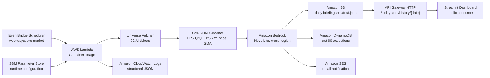

<div align="center">

# AlphaGen Daily

**Fully autonomous serverless AI agent on AWS that screens AI-related US stocks every trading day and generates investment briefings powered by Amazon Bedrock.**

[](https://aws.amazon.com/)
[](https://aws.amazon.com/bedrock/)
[](https://aws.amazon.com/serverless/sam/)
[](https://www.python.org/)
[](https://www.docker.com/)
[](https://opensource.org/licenses/MIT)
[](https://aws.amazon.com/)

**Live dashboard:** [https://alphagen-daily.streamlit.app](https://alphagen-daily.streamlit.app)
**Repository:** [https://github.com/Ant4rez/Alphagen-Daily](https://github.com/Ant4rez/Alphagen-Daily)

</div>

---

## TL;DR

AlphaGen Daily runs autonomously every US trading day before market open. It fetches price history and fundamentals for a curated universe of **72 AI-related tickers**, applies **CANSLIM-inspired quantitative filters**, and asks **Amazon Bedrock (Nova Lite)** to generate a concise investment thesis and key risk for each approved ticker. The full pipeline runs end-to-end in **~72 seconds** and costs **less than US$ 1 per month**.

Built as a submission to the **AWS Weekend Creative Agent Challenge (August 2026)**.

---

## Screenshots

> Streamlit dashboard consuming the public API — updated every trading day.

_Add screenshots to `docs/screenshots/` and reference them here._

``

---

## Architecture



**Ten AWS services integrated as Infrastructure as Code with a single AWS SAM template.**

For a deeper dive on design decisions, see [`ARCHITECTURE.md`](ARCHITECTURE.md).

---

## Features

- **Fully autonomous.** No manual steps. No console. The agent runs itself on a cron schedule.
- **Curated AI universe.** 72 US tickers across semiconductors, hyperscalers, enterprise AI SaaS, cloud data platforms, and AI infrastructure.
- **CANSLIM-inspired screening.** Quantitative filters on earnings growth (Q/Q and Y/Y), price ceiling, and moving-average trend.
- **LLM-generated investment thesis.** Each approved ticker gets a concise thesis and a key risk, generated by Amazon Bedrock Nova Lite using structured prompts.
- **Output validation.** JSON output from the LLM is validated against a strict schema before persistence.
- **Graceful failure handling.** Delisted or missing tickers are skipped without breaking the pipeline (verified in production with tickers such as `CFLT`, `JNPR`, `HCP`).
- **Public HTTP API.** Consumers query `/today` for the latest briefing or `/history/{date}` for a specific day.
- **Structured observability.** JSON logs in CloudWatch with request IDs, ticker counts, rejection reasons, and per-stage timing.
- **Least-privilege IAM.** Each function scope has narrow permissions defined in SAM.

---

## Results and metrics

Measured in production (CloudWatch, run of 2026-08-31):

| Metric | Value |
|---|---|
| Universe size | 72 tickers |
| Successfully fetched | 69 tickers |
| Delisted / skipped | 3 tickers |
| Approved by CANSLIM screener | 8 tickers |
| Average approval rate | ~11% |
| End-to-end Lambda duration | **~72 seconds** |
| Billed Lambda duration | ~75 seconds |
| Memory provisioned | 1,536 MB |
| Peak memory used | 223 MB |
| Init duration (cold start) | ~2.8 seconds |
| Bedrock invocation time per ticker | ~1.2 seconds |
| **Estimated monthly cost** | **< US$ 1** |

Sample approved tickers (2026-08-31): `AMZN`, `ANET`, `AVGO`, `DELL`, `FTNT`, `GOOGL`, `NVDA`, `OKTA`.

Rejection breakdown per screening rule (same run):

| Rule | Rejected |
|---|---|
| EPS Q/Q growth | 33 |
| Simple Moving Average uptrend | 22 |
| Price ceiling | 5 |
| EPS Y/Y growth | 1 |

---

## Tech stack

**Cloud and Runtime**
- AWS Lambda (Docker Container Image, Python 3.11)
- Amazon EventBridge Scheduler
- Amazon Bedrock (Nova Lite with cross-region inference profile)
- Amazon S3, Amazon DynamoDB
- Amazon API Gateway HTTP
- Amazon SES
- Amazon CloudWatch Logs
- AWS Systems Manager Parameter Store
- AWS Identity and Access Management (IAM)

**Infrastructure as Code**
- AWS SAM (single template, ten services)
- Docker (multi-stage build for Lambda Container Image)

**Application**
- Python 3.11
- `boto3` for AWS SDK
- `yfinance` for market data
- `pandas` for data manipulation
- Custom prompt engineering utilities

**Frontend consumer**
- Streamlit dashboard (`web/`), consuming the public API

---

## Repository structure

```
Alphagen-Daily/
├── docs/                    Additional documentation and diagrams
├── infrastructure/          AWS SAM template and deploy scripts
├── src/                     Lambda source code
│   ├── handler.py           Entry point
│   ├── fetcher.py           Universe download and normalization
│   ├── screener.py          CANSLIM filters
│   ├── analyzer.py          Bedrock invocation and validation
│   ├── storage.py           S3 and DynamoDB persistence
│   └── notifier.py          SES email delivery
├── tests/                   Unit tests
├── web/                     Streamlit dashboard
├── ARCHITECTURE.md          System design deep dive
├── CONTEXT.md               Product context and goals
├── CONTRIBUTING.md          Contribution guidelines
├── Dockerfile               Lambda Container Image build
├── Makefile                 Deploy and utility targets
├── requirements.txt         Runtime dependencies
├── requirements-dev.txt     Development dependencies
└── README.md                This file
```

---

## Quickstart

**Prerequisites**
- AWS account with Amazon Bedrock model access enabled for Nova Lite
- AWS CLI configured with a profile that has deployment permissions
- AWS SAM CLI installed
- Docker installed and running
- Python 3.11

**Clone and set up local environment**

```bash
git clone https://github.com/Ant4rez/Alphagen-Daily.git
cd Alphagen-Daily

python -m venv .venv
source .venv/bin/activate            # Linux / macOS
# .venv\Scripts\activate              # Windows

pip install -r requirements.txt -r requirements-dev.txt
```

**Run tests**

```bash
make test
```

**Deploy to AWS**

```bash
make deploy
```

The Makefile wraps `sam build` and `sam deploy` with sensible defaults. See [`infrastructure/`](infrastructure/) for the SAM template and parameter files.

---

## Configuration

Runtime configuration lives in AWS Systems Manager Parameter Store, not in code. This lets you tune the agent without redeploying.

Key parameters:

| Parameter | Purpose |
|---|---|
| `min_eps_qoq` | Minimum quarter-over-quarter EPS growth (%) |
| `min_eps_yoy` | Minimum year-over-year EPS growth (%) |
| `max_price` | Maximum ticker price (US$) |
| `require_sma_uptrend` | Enforce short SMA above long SMA |
| `universe_size` | Number of tickers in the curated universe |
| `notify_enabled` | Toggle SES email delivery |

Sensitive values (Bedrock region, SES sender) live in SAM parameters and are injected as Lambda environment variables at deploy time.

---

## Public API

Base URL is provisioned by API Gateway at deploy time and returned in the SAM outputs.

- `GET /today` — returns the latest briefing (JSON)
- `GET /history/{date}` — returns the briefing for a specific date (`YYYY-MM-DD`)

Sample response:

```json
{
  "run_date": "2026-08-31",
  "universe_size": 72,
  "approved_count": 8,
  "approved": [
    {
      "symbol": "NVDA",
      "price": 128.45,
      "thesis": "…",
      "key_risk": "…"
    }
  ]
}
```

---

## Roadmap

- [ ] Add Brazilian market (B3) support with adjusted CANSLIM thresholds
- [ ] Add sentiment layer from news headlines
- [ ] Add Slack delivery via Amazon SNS
- [ ] Add multi-strategy screening (value, dividend, quality)
- [ ] Add backtest module for historical validation
- [ ] Migrate deploy pipeline to GitHub Actions (CI/CD)
- [ ] Optimize Lambda memory from 1,536 MB to 512 MB (peak usage is 223 MB)

---

## Contributing

Contributions are welcome. See [`CONTRIBUTING.md`](CONTRIBUTING.md) for guidelines. Bugs, suggestions, and pull requests can be opened via the Issues tab.

---

## License

MIT — see [`LICENSE`](LICENSE).

---

## Author

**Thiago Fiel de Oliveira**
Data Science student at FIAP · AWS Certified AI Practitioner
[LinkedIn](https://www.linkedin.com/in/thiagofieldeoliveira) · [GitHub](https://github.com/Ant4rez)

Built as a submission to the **AWS Weekend Creative Agent Challenge (August 2026)**.


[](https://www.linkedin.com/in/thiagofieldeoliveira/)
[](https://github.com/Ant4rez)