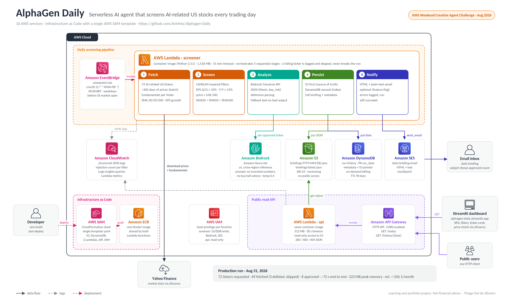
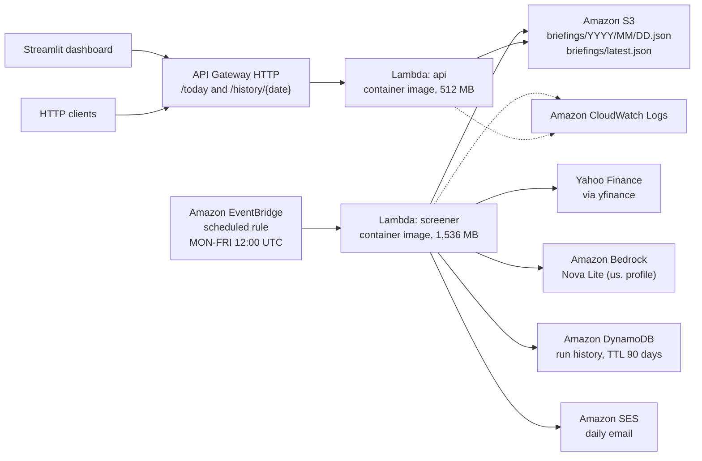

<div align="center">

# AlphaGen Daily

**Serverless AI agent on AWS that screens AI-related US stocks every trading day and generates analytical briefings with Amazon Bedrock.**

[](https://aws.amazon.com/)
[](https://aws.amazon.com/bedrock/)
[](https://aws.amazon.com/serverless/sam/)
[](https://www.python.org/)
[](https://www.docker.com/)
[](https://alphagen-daily.streamlit.app)
[](LICENSE)

**Live dashboard:** [https://alphagen-daily.streamlit.app](https://alphagen-daily.streamlit.app)

Built for the **AWS Weekend Creative Agent Challenge (August 2026)**.

</div>

---

## TL;DR

Every US trading day, before the market opens, AlphaGen Daily downloads prices and fundamentals for a curated universe of **72 AI-related tickers**, applies **CANSLIM-inspired quantitative filters**, and asks **Amazon Bedrock (Nova Lite)** to write a short thesis and key risk for each approved ticker. The briefing is stored in S3 and DynamoDB, sent by email and exposed through a public HTTP API consumed by a Streamlit dashboard.

No manual steps. No console. **~72 seconds per run** and an estimated **cost below US$ 1 per month**.

> Learning and portfolio project. Nothing here is financial advice.

---

## Architecture



AlphaGen Daily is made of **two independent services** that share the same repository and the same Docker image, but run as separate Lambda functions:

- **Screener:** daily batch pipeline. Downloads data, filters it, analyzes it with an LLM and persists the results.
- **API:** on-demand reader of the persisted briefings.

**10 AWS services**, all defined as Infrastructure as Code in a single AWS SAM template: Amazon EventBridge, AWS Lambda, Amazon ECR, Amazon Bedrock, Amazon S3, Amazon DynamoDB, Amazon SES, Amazon API Gateway, Amazon CloudWatch and AWS IAM.

<details>
<summary>Text version of the diagram (Mermaid)</summary>



</details>

For module contracts, data model, IAM map and trade-offs, see [`ARCHITECTURE.md`](ARCHITECTURE.md).

---

## How it works

The screener handler (`src/handler.py`) runs five sequential stages:

| # | Stage | Module | What happens |
|---|---|---|---|
| 1 | **Fetch** | `fetcher.py` | One batched download of ~300 days of prices for all tickers, then fundamentals ticker by ticker. Each ticker becomes an immutable snapshot with SMA 20/50/200 and EPS growth. |
| 2 | **Screen** | `screener.py` | Pluggable filters applied in order. Missing data means rejection. A counter per rejection reason is logged. |
| 3 | **Analyze** | `analyzer.py` | Amazon Bedrock Converse API returns a JSON object with `thesis` and `key_risk` for each approved ticker. |
| 4 | **Persist** | `storage.py` | Full briefing to S3 first (source of truth), then a metadata item to DynamoDB (index). |
| 5 | **Notify** | `notifier.py` | HTML and plain-text email through Amazon SES. Optional, controlled by a flag. |

Filters deployed in production:

| Filter | Rule |
|---|---|
| `eps_qoq` | Quarter-over-quarter EPS growth ≥ 10% |
| `eps_yoy` | Year-over-year EPS growth ≥ 15% |
| `price_cap` | Price ≤ US$ 500 |
| `sma20_gt_sma50` | SMA20 > SMA50 |
| `sma50_gt_sma200` | SMA50 > SMA200 |

Also available: `price_above_sma20` and `price_above_sma200`.

---

## Design principles

- **Serverless first.** No long-running components. Idle cost is zero, and all state lives in S3 and DynamoDB.
- **Degrade, never cascade.** A failing ticker is logged and skipped. A malformed LLM response never drops a ticker: a defensive parser handles markdown fences and empty fields, and falls back to a default text. An email failure never fails a run whose briefing is already persisted.
- **Deterministic rules first, LLM second.** The screener decides which tickers move forward. The model only writes the narrative, so Bedrock usage scales with approved tickers, not with the whole universe.
- **Guarded prompting.** A fixed system prompt frames the model as a disciplined equity research assistant, forbids invented numbers and forbids buy or sell recommendations (`temperature=0.4`, `maxTokens=400`).
- **Configuration out of the code.** Every threshold and switch is an environment variable defined in `template.yaml`. No module reads `os.environ` directly: everything goes through one immutable `Config` object.
- **One image, two functions.** Both Lambdas use the same container image. The SAM template only changes the entry point (`ImageConfig.Command`).
- **Least privilege.** The screener can write to S3 and DynamoDB, call Bedrock and send email. The API function is read-only.

---

## Results and metrics

Measured in production (CloudWatch, run of **2026-08-31**):

| Metric | Value |
|---|---|
| Tickers requested | 72 |
| Successfully fetched | 69 |
| Delisted or unavailable (skipped) | 3 (`CFLT`, `JNPR`, `HCP`) |
| Approved by the screener | 8 (~11%) |
| End-to-end duration | **~72 s** |
| Billed duration | ~75 s |
| Init duration (cold start) | ~2.8 s |
| Memory provisioned / peak used | 1,536 MB / 223 MB |
| **Estimated monthly cost** | **< US$ 1** |

Approved tickers that day: `AMZN`, `ANET`, `AVGO`, `DELL`, `FTNT`, `GOOGL`, `NVDA`, `OKTA`.

Rejections per filter (same run):

| Filter | Rejected |
|---|---|
| EPS growth, quarter over quarter | 33 |
| Moving-average uptrend | 22 |
| Price ceiling | 5 |
| EPS growth, year over year | 1 |

---

## Tech stack

**AWS**
- AWS Lambda (container images, Python 3.11) and Amazon ECR
- Amazon EventBridge (scheduled rule)
- Amazon Bedrock (Amazon Nova Lite through the `us.` cross-region inference profile, Converse API)
- Amazon S3 (SSE-S3, versioning, public access blocked)
- Amazon DynamoDB (on-demand, TTL)
- Amazon API Gateway (HTTP API)
- Amazon SES
- Amazon CloudWatch Logs
- AWS IAM
- AWS SAM / AWS CloudFormation

**Application**
- Python 3.11, `boto3`, `yfinance`, `pandas`
- Structured JSON logging (`src/utils/logger.py`)

**Dashboard**
- Streamlit on Streamlit Community Cloud, Plotly charts (`web/app.py`)

---

## Repository structure

```
Alphagen-Daily/
├── infrastructure/
│   ├── template.yaml          SAM template (source of truth for the infrastructure)
│   ├── samconfig.toml         SAM CLI configuration
│   └── parameters/            Environment parameters
├── src/
│   ├── handler.py             Screener entry point (orchestrates the 5 stages)
│   ├── api_handler.py         API entry point (/today and /history/{date})
│   ├── fetcher.py             Prices and fundamentals via yfinance
│   ├── screener.py            Pluggable CANSLIM-inspired filters
│   ├── analyzer.py            Bedrock Converse call and defensive parsing
│   ├── storage.py             S3 and DynamoDB persistence
│   ├── notifier.py            HTML and plain-text email via SES
│   ├── models/                Ticker, ScreeningResult and DailyBriefing dataclasses
│   ├── universe/              Curated AI ticker universe
│   └── utils/                 Config loader and JSON logger
├── web/                       Streamlit dashboard (own requirements.txt)
├── tests/                     Unit tests
├── docs/                      Images and additional documentation
├── ARCHITECTURE.md            Technical deep dive
├── CONTEXT.md                 Product context and decisions
├── Dockerfile                 Shared image for both Lambda functions
├── Makefile                   Test and deploy shortcuts
└── requirements.txt           Backend dependencies
```

---

## Quickstart

**Prerequisites**
- AWS account with Amazon Bedrock model access enabled for Nova Lite
- AWS CLI configured
- AWS SAM CLI and Docker installed
- Python 3.11

**Local setup and tests**

```bash
git clone https://github.com/Ant4rez/Alphagen-Daily.git
cd Alphagen-Daily

python -m venv .venv
source .venv/bin/activate            # Linux / macOS
# .venv\Scripts\activate              # Windows

pip install -r requirements.txt -r requirements-dev.txt
make test
```

**Deploy**

```bash
make deploy
```

Or directly with the SAM CLI:

```bash
cd infrastructure
sam build --use-container
sam deploy
```

The first deploy asks for the stack parameters (`Environment`, `BedrockModelId`, `ScheduleExpression`, SES settings) and saves them in `samconfig.toml`. If only environment variables changed, `sam deploy` alone updates the functions without rebuilding the image.

---

## Configuration

All configuration comes from environment variables defined in `infrastructure/template.yaml` and loaded by `src/utils/config.py`.

| Variable | Deployed value | Purpose |
|---|---|---|
| `BEDROCK_MODEL_ID` | `us.amazon.nova-lite-v1:0` | Bedrock model (cross-region inference profile) |
| `BEDROCK_MAX_TOKENS` | `400` | Response token limit |
| `BEDROCK_TEMPERATURE` | `0.4` | Sampling temperature |
| `MIN_EPS_GROWTH_QOQ` | `10` | Minimum quarter-over-quarter EPS growth (%) |
| `MIN_EPS_GROWTH_YOY` | `15` | Minimum year-over-year EPS growth (%) |
| `MAX_PRICE` | `500` | Maximum price (US$) |
| `ACTIVE_FILTERS` | `eps_qoq,eps_yoy,price_cap,sma20_gt_sma50,sma50_gt_sma200` | Filters applied, in order |
| `NOTIFY_ENABLED` | `true` | Master switch for email |
| `SES_SENDER` / `SES_RECIPIENTS` | set at deploy time | Verified SES sender and recipients |
| `LOG_LEVEL` | `INFO` | Log level |

The schedule is the `ScheduleExpression` parameter: `cron(0 12 ? * MON-FRI *)`, which is 12:00 UTC (09:00 in Brazil) on weekdays.

---

## Public API

The base URL is returned in the stack outputs (`ApiEndpoint`).

| Method | Path | Response |
|---|---|---|
| GET | `/today` | Latest briefing (`briefings/latest.json`) |
| GET | `/history/{YYYY-MM-DD}` | Briefing for a given date |

Status codes: `200` success, `400` invalid date format, `404` briefing not found. Responses are always JSON with CORS enabled.

Simplified response shape:

```json
{
  "run_date": "2026-08-31",
  "approved_count": 8,
  "results": [
    {
      "ticker": { "symbol": "NVDA", "...": "..." },
      "thesis": "…",
      "key_risk": "…",
      "llm_model": "us.amazon.nova-lite-v1:0"
    }
  ]
}
```

---

## Observability

Every log line is a compact JSON object, which makes CloudWatch Logs Insights queries straightforward. Example, daily approved count:

```
fields @timestamp, approved_count
| filter message = "AlphaGen Daily run complete"
| sort @timestamp desc
```

More queries in [`ARCHITECTURE.md`](ARCHITECTURE.md#11-observabilidade).

---

## Known limitations

- **Serial fetch is the bottleneck** (about 40 s per run). Parallel requests were tried, but the data source rate-limits datacenter IPs.
- **No retry on Bedrock throttling.** A failed call falls back to a default text instead of retrying.
- **Minimal test coverage.** Tests for the screener rules and the LLM parser are the next priority.
- **Static universe.** Adding a ticker requires a code change and a redeploy.

---

## Roadmap

- [ ] Right-size screener memory (1,536 MB to 512 MB; peak usage is 223 MB)
- [ ] Retry with exponential backoff on Bedrock throttling
- [ ] Unit tests for `screener.py` and the LLM response parser
- [ ] CI/CD with GitHub Actions
- [ ] CloudWatch alarms and API throttling
- [ ] Brazilian market (B3) support with adjusted thresholds
- [ ] Sentiment layer from news headlines
- [ ] Backtest module for historical validation

---

## Contributing

Contributions are welcome. See [`CONTRIBUTING.md`](CONTRIBUTING.md). Bugs and suggestions can be opened in the Issues tab.

---

## License

MIT. See [`LICENSE`](LICENSE).

---

## Author

**Thiago Fiel de Oliveira**
Data Science student at FIAP · AWS Certified AI Practitioner · AWS re/Start graduate

[](https://www.linkedin.com/in/thiagofieldeoliveira/)
[](https://github.com/Ant4rez)
